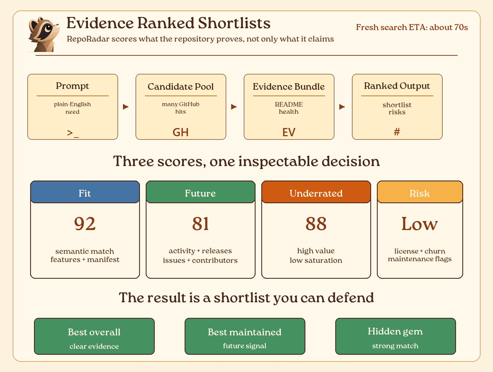
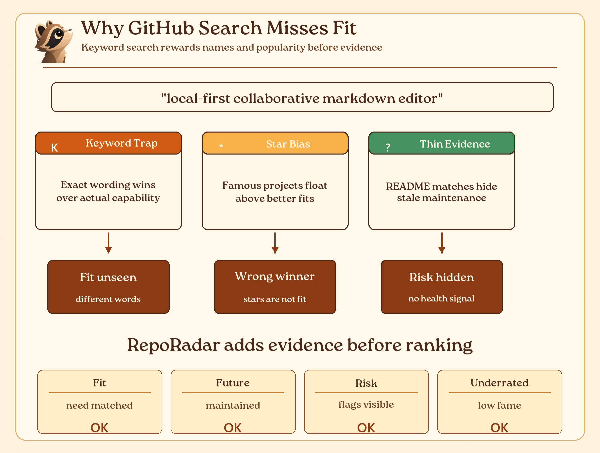
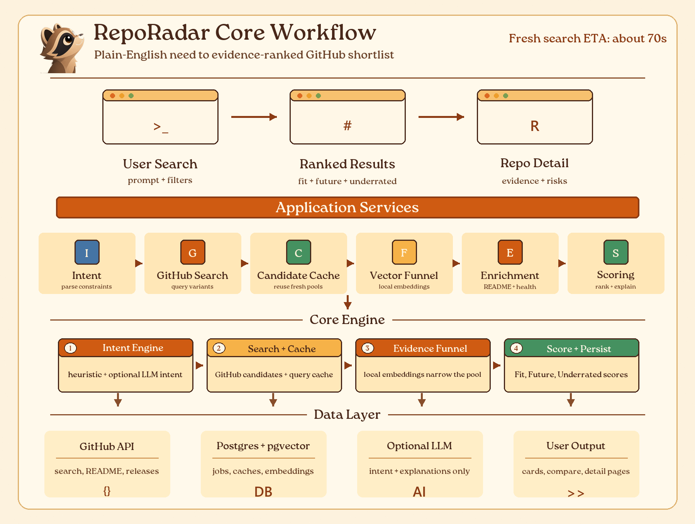

<div align="center">

# RepoRadar

### Semantic GitHub repository discovery for people who need the right project, not the most famous one.

Search by intent. Rank by fit, evidence, health, risk, and underrated potential.

[](https://nextjs.org)
[](https://www.typescriptlang.org/)
[](https://github.com/pgvector/pgvector)
[](#no-credit-card-required)
[](./LICENSE)
[](#contributing)

[Live demo](https://reporadar.up.railway.app/) · [Watch demo](./public/reporadar-demo.mp4) · [Quick start](#quick-start) · [Why star this](#why-star-this)

</div>

---

<div align="center">

<video controls autoplay muted loop playsinline width="100%" style="max-width: 980px; border-radius: 16px;">
  <source src="./public/reporadar-demo.mp4" type="video/mp4" />
  Your browser does not support the embedded demo video.
</video>

</div>



## What It Solves

GitHub search is excellent when you already know the right keywords. It is weaker when you know the
job you need done but not the exact repository name, ecosystem wording, or hidden-gem project.

RepoRadar turns a plain-English need into an inspectable shortlist. It searches broadly, narrows with
local semantic signals, enriches survivors with repository evidence, and ranks them by usefulness
rather than popularity alone.



## At A Glance

| Area | RepoRadar does |
|---|---|
| Input | Natural-language repository search with filters |
| Output | Ranked repositories with evidence, risks, and comparisons |
| Ranking | Fit, Future, Underrated, and risk signals |
| Evidence | README, manifests, releases, issues, PRs, contributors, stars, forks, topics |
| Stack | Next.js, TypeScript, Prisma, PostgreSQL, pgvector, Octokit |
| Runtime | Local embeddings first, optional LLM explanation second |
| Search time | Fresh searches usually take about 60-70 seconds |
| Deploy | Railway-friendly, self-hostable, no paid services required in `NO_LLM_MODE=true` |

## Why People Use It

- Search by capability instead of keyword luck.
- Find smaller projects that are healthy but not yet famous.
- Compare repositories with the evidence visible.
- See why a repo ranked highly, what it is missing, and what risks to inspect.
- Keep LLMs out of raw fact collection: GitHub data is fetched directly, then explained.

## How It Works



| Stage | What happens | Why it matters |
|---|---|---|
| Intent | Parses the user's plain-English need into search constraints; "alternative to X" / "like X" prompts resolve X and derive dedicated queries | Short prompts become structured searches, and reference-style prompts gain the domain vocabulary their literal words lack |
| GitHub search | Runs multiple query variants, including `sort:stars`/`sort:updated` re-issues, RRF-fused | Canonical high-star and freshly-active repos reliably enter the pool |
| Diverse sources | Mines `awesome-*` lists and npm/crates.io search; quality-gated repos join the pool | Human-curated and registry-ranked repos GitHub's "best match" buries become candidates |
| Candidate cache | Reuses fresh candidate pools when possible | Keeps repeated searches faster and cheaper |
| Vector funnel | Local embeddings (conjunctive per-aspect) + a credibility floor narrow the pool | Drops weak matches and keyword-stuffed 0-signal repos before expensive enrichment |
| Cross-encoder rerank | A local (query, repo)-pair model reranks the shortlist, paired with a prominence co-signal | Sharper relevance without burying canonical projects under keyword-similar demos |
| Enrichment | Fetches README, manifests, releases, issues, PRs, contributors, and metadata | Scores are grounded in observable evidence |
| Scoring | One listwise pass ranks survivors and flags off-topic repos; produces Fit, Future, Underrated, and risk signals | Results are ranked for actual usefulness, and irrelevant repos are demoted instead of padding the shortlist |

> v1.1.3 adds sort-variant recall and a local cross-encoder reranker (both **on by default** — together
> +0.044 nDCG / +0.064 recall and half the trap-leak on the gold set), plus a labeled eval harness and an
> opt-in toolbox (HyDE, hybrid BM25, topic expansion, MMR) documented in `.env.example`. See `PLAN.md`.
>
> v1.1.4 adds the query-understanding + diverse-sources layer: reference resolution for
> "alternative to X" prompts, awesome-list mining, package-registry retrieval (all **on by default**,
> quality-gated), and a fixed canonical-rescue budget. See `CHANGELOG.md` for measured results.

## What You Get On Screen

| View | What it shows |
|---|---|
| Search | Compact prompt box, filters, example queries, and progress state |
| Results | Ranked cards, hidden gems, score badges, risks, evidence summaries, and compare controls |
| Repo detail | README evidence, trend signals, health indicators, and risk explanations |
| About | Pipeline explanation and score composition |
| Status | Database, pgvector, embedding, LLM, and typical search-time health |

## Score Model

| Score | Meaning |
|---|---|
| Fit | How well the repo matches the user's actual need |
| Future | Whether the repo looks maintained and likely to remain useful |
| Underrated | Whether the repo has high signal without being saturated by popularity |
| Risk | Missing license, stale activity, weak release history, or other inspection flags |

The model is deterministic first and model-assisted second. The LLM can help with intent and
explanations, but raw counts and repository facts come from GitHub and the database.

## No Credit Card Required

- Embeddings run locally and free via Transformers.js.
- `NO_LLM_MODE=true` runs the full pipeline without paid model calls.
- The optional LLM layer uses an OpenAI-compatible endpoint, so you can choose the provider.

## Quick Start

```bash
# 1. configure
cp .env.example .env

# 2. database (Postgres + pgvector)
docker compose up -d

# 3. install + migrate + run
pnpm install
pnpm db:deploy
pnpm dev
```

Open [http://localhost:2000](http://localhost:2000) and search.

Good first searches:

- `browser testing`
- `notion editor`
- `simple react state`
- `local-first collaborative markdown editor`
- `open-source alternative to Firebase Auth for Next.js`

Fresh searches usually take about 60-70 seconds. Warm repeat searches can be faster because
candidate pools and enrichment evidence are cached.

## Configuration

Important environment variables:

| Variable | Purpose |
|---|---|
| `DATABASE_URL` | PostgreSQL connection string with pgvector |
| `GITHUB_TOKEN` | Raises GitHub API limits for search and enrichment |
| `OPENROUTER_API_KEY` | Enables optional model-assisted scoring and explanation |
| `NO_LLM_MODE` | Runs deterministic-only mode when set to `true` |
| `MAX_SEARCH_QUERIES` | Controls how many GitHub query variants are executed |
| `FUNNEL_TOP_N` | Controls how many candidates survive the local funnel |
| `LIGHT_ENRICH_TOP_N` | Controls cheap pre-funnel enrichment |
| `INTENT_TIMEOUT_MS` | Timeout for intent extraction |
| `LISTWISE_TIMEOUT_MS` | Timeout for listwise ranking |
| `SEARCH_ETA_SECONDS` | Progress-bar estimate, currently calibrated around `67` |
| `SEARCH_DEBUG` | When `true`, writes per-candidate funnel/ranking traces to `logs/search-debug.jsonl` (local tuning only) |
| `GITHUB_PER_PAGE` | Results fetched per GitHub query (recall lever; default `40`) |
| `SEARCH_SORT_VARIANTS` | Re-issue top queries under `sort:stars`/`sort:updated` and RRF-fuse (recall) |
| `HYDE` | Embed an LLM-written "ideal repo" description alongside the query (recall) |
| `CROSS_ENCODER_RERANK` | Local cross-encoder reranks the funnel shortlist (precision) |
| `RERANK_MODEL` | Cross-encoder model id (default `Xenova/ms-marco-MiniLM-L-6-v2`) |

## Search Quality Diagnostics

RepoRadar ships a labeled-gold-set evaluation harness for measuring search quality changes:

```bash
# Run the gold set, compute metrics, save a tagged report under logs/eval/
EVAL_TAG=baseline EVAL_REPEATS=2 node scripts/eval/run-eval.mjs
# Diff two runs (control vs candidate)
node scripts/eval/report.mjs baseline candidate
```

It reports nDCG@10, Recall@15, pool recall, MRR, trap-leak, junk rate, and latency over a field-diverse
prompt set (`scripts/eval/gold.json`). Use it to A/B any ranking change. Note: GitHub returns different
pools across calls and temperature-0 intent still varies via provider routing, so trust the **median of
≥3 repeats** and treat sub-0.03 nDCG deltas as noise.

There is also a shorter manual benchmark:

```bash
node scripts/search-benchmark.mjs --limit 6
```

It uses general-user prompts such as `browser testing`, `notion editor`, and `simple react state`.
It reports top repositories, expected-known repo presence, latency, and diagnostic evidence in
`logs/search-diagnostics.jsonl`.

For a single ad-hoc query you can run the local runner and print the ranked shortlist with
per-repo fit/future/similarity/source:

```bash
node scripts/run-search.mjs "kubernetes monitoring and observability"
```

Set `SEARCH_DEBUG=true` first to also capture per-candidate funnel scores (similarity, aspect
sims, prefilter score, survivor flags) and final rank scores in `logs/search-debug.jsonl` — the
fastest way to see *why* a repo was kept, dropped, or ranked where it was. The `logs/` directory
is gitignored.

## Local Docs

- [Setup guide](./setup.txt)
- [Architecture and product spec](./REPORADAR.md)
- [Changelog](./CHANGELOG.md)

README visual assets are generated with Python and Pillow:

```bash
python scripts/generate_readme_workflow.py
python scripts/generate_readme_concept_diagrams.py
```

## Contributing

RepoRadar gets stronger when search failures are visible and fixable.

- Open an issue with a query that ranked poorly.
- Improve the scoring rubric or evidence extraction.
- Add manifest parsers, chart types, or accessibility improvements.
- Keep the README and docs in sync with product behavior.

## Why Star This

Star RepoRadar if you want open-source discovery to reward usefulness, evidence, and maintenance
instead of only marketing reach or historical popularity.

A star helps the project reach more builders looking for the right dependency and more maintainers
whose good projects deserve to be found.

## License

[MIT](./LICENSE) - free to use, self-host, fork, and build on.
