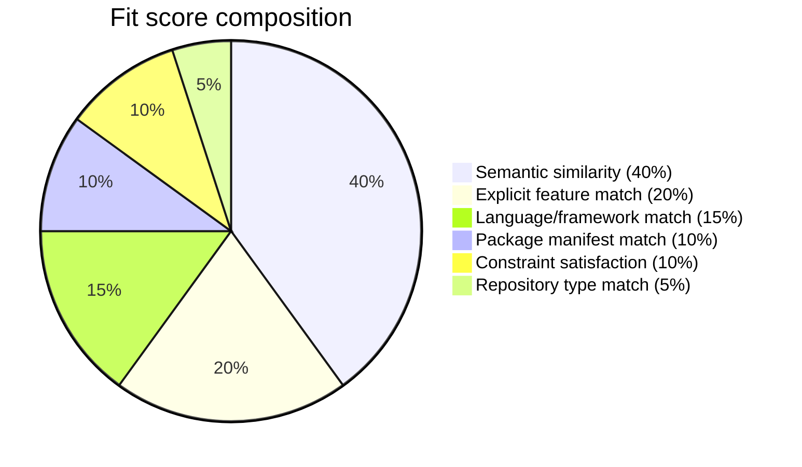
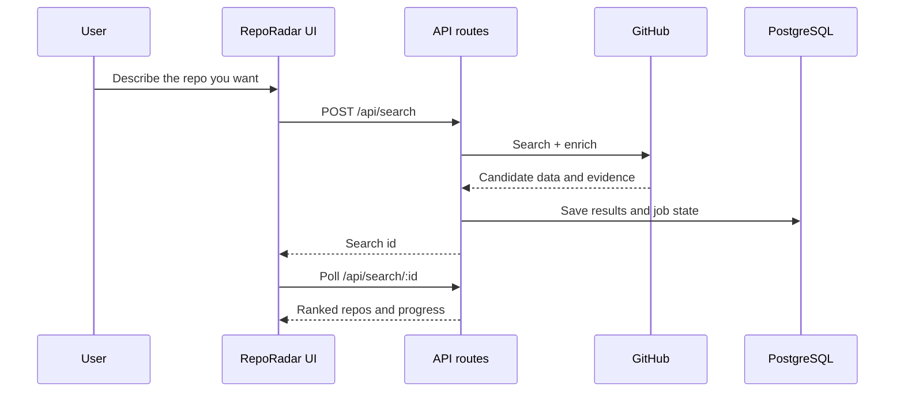

<div align="center">

# RepoRadar

### Find the right open-source project by what it does, not by what it’s called.

Search GitHub by intent, then rank repos by fit, evidence, and health instead of popularity.

[](https://nextjs.org)
[](https://www.typescriptlang.org/)
[](https://github.com/pgvector/pgvector)
[](#no-credit-card-required)
[](./LICENSE)
[](#contributing)

[Live demo](https://reporadar.up.railway.app/) · [Quick start](#quick-start) · [Why star this](#why-star-this)

</div>

---


## What it is

RepoRadar is a semantic GitHub repository discovery and evaluation engine. You describe the repo
you need in plain English, it finds candidate repositories, enriches them with evidence, scores
them transparently, and returns a ranked shortlist with explanations.

It is built for two audiences:

- Builders who need the right repo fast.
- Maintainers who want strong projects to be found on merit, not star count.
- Anyone who wants to stop scrolling through popularity bias.

## At a glance

| Area | RepoRadar does |
|---|---|
| Input | Natural-language repo search plus filters |
| Output | Ranked repositories with evidence, risks, and comparisons |
| Ranking | Fit, Future, and Underrated scores |
| Stack | Next.js, TypeScript, Prisma, PostgreSQL, pgvector, Octokit |
| ETA | Fresh searches usually take about 40 seconds |
| Deploy | Railway-friendly, self-hostable, no paid services required in `NO_LLM_MODE=true` |

## Why people star it

- It solves a real problem most GitHub search flows do not: finding the right repo by capability,
  not name or star count.
- The ranking is explainable. Users can inspect the evidence instead of trusting a black box.
- It has a live demo and a local-free mode, so people can try it quickly without a complicated
  setup.
- The project is useful to builders, maintainers, and people who review open source for a living.

## Why people use it

- Search by function, not by keyword luck.
- Compare repositories with the evidence visible.
- Surface smaller but better-maintained projects.
- Keep the ranking formula auditable instead of opaque.

## How it works

| Stage | What happens | Output |
|---|---|---|
| 1 | You describe the repository you need in plain English. | Search intent |
| 2 | RepoRadar expands the prompt into several GitHub-compatible queries. | Query variants |
| 3 | GitHub search returns candidates, which are deduped and filtered. | Candidate pool |
| 4 | The deterministic funnel narrows the pool with local embeddings and cheap signals. | Smaller shortlist |
| 5 | Survivors are enriched with README, manifest, release, issue, and contributor evidence. | Evidence bundle |
| 6 | Fit, Future, and Underrated scores are computed and explained. | Ranked results |

The pipeline is deterministic first and model-assisted second:

- Search queries expand from intent.
- Candidates are deduped and narrowed with local signals.
- Repo evidence comes from README, manifests, releases, issues, and contributor metadata.
- The model is used for explanation and classification, not as the source of truth for raw counts.

## How the scores are composed

### Fit



### Future

Future score is a weighted health estimate built from:

- Recent activity
- Release cadence
- Issue/PR health
- Contributor health
- Star velocity
- Documentation quality
- Ecosystem signal
- Risk penalties

### Underrated

Underrated score favors repositories that are:

- Highly relevant
- Healthy and useful
- Well documented
- Still growing
- Not already saturated by popularity

## What you get on screen

- Search page with compact filters and example queries
- About page that explains the pipeline and score composition
- Results page with ranked cards, score breakdowns, and compare view
- Repo detail page with evidence, trends, and risks

## Request flow



## No credit card required

- Embeddings run locally and free via Transformers.js.
- `NO_LLM_MODE=true` runs the full pipeline without paid model calls.
- The optional LLM layer uses an OpenAI-compatible endpoint, so you can choose the provider.

## Search quality diagnostics

RepoRadar includes a short manual diagnostic benchmark for search quality:

```bash
node scripts/search-benchmark.mjs --limit 6
```

It uses short general-user prompts such as `browser testing`, `notion editor`, and `simple react
state`. It does not compute a deterministic score or CI grade. It reports top repos,
expected-known repo presence, latency, and points to `logs/search-diagnostics.jsonl` for generated
queries and candidate-pool evidence.

## Quick start

```bash
# 1. configure
cp .env.example .env

# 2. database (Postgres + pgvector)
docker compose up -d

# 3. install + migrate + run
pnpm install
pnpm db:deploy
pnpm dev
```

Open [http://localhost:2000](http://localhost:2000) and search.

If you want to judge the project before installing anything, start with the live demo above and try a
few searches such as `browser testing`, `notion editor`, or `simple react state`.

## Configuration

Important environment variables:

- `DATABASE_URL`
- `GITHUB_TOKEN`
- `OPENROUTER_API_KEY`
- `NO_LLM_MODE`
- `FUNNEL_TOP_N`
- `MAX_SEARCH_QUERIES`
- `LIGHT_ENRICH_TOP_N`
- `INTENT_TIMEOUT_MS`
- `LISTWISE_TIMEOUT_MS`
- `SEARCH_ETA_SECONDS`

If you want the default progress estimate to match the current UI, keep `SEARCH_ETA_SECONDS=40`.

## Local docs

- [Setup guide](./setup.txt)
- [Project status](./PROGRESS.md)
- [Architecture and product spec](./REPORADAR.md)
- [Changelog](./CHANGELOG.md)

README visual assets are generated with Python and Pillow:

```bash
python scripts/generate_readme_workflow.py
```

## Contributing

RepoRadar gets stronger when people can understand and trust it quickly.

- Open an issue with a query that ranked poorly.
- Improve the scoring rubric or evidence extraction.
- Add manifest parsers, chart types, or accessibility improvements.
- Keep the README and docs in sync with the product.

## Why star this

If RepoRadar saves you time, star it so more builders and maintainers can find a tool that ranks
repos by usefulness instead of popularity. Stars also help the project reach people who are tired
of keyword-only search and want evidence they can trust.

If you want to help without much effort, one star and one share are the most effective signals.

## License

[MIT](./LICENSE) - free to use, self-host, fork, and build on.
